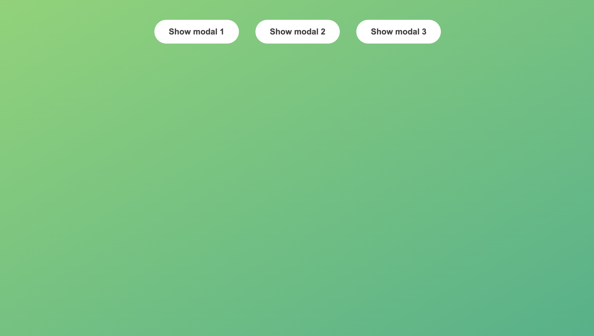
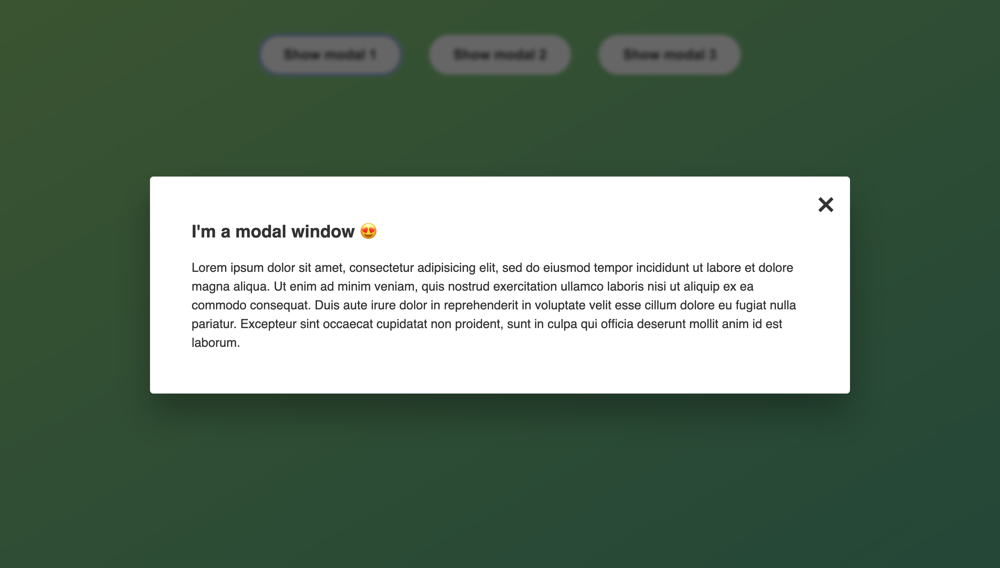

# Modal View

In my #50daysofCode Challenge I wanted to practice not just full fledged projects but interesting features/functionalities I would include in a project. In this repository I created a modal pop up.

Functionality

- Modal pop up on 3 seperate buttons
- Close feature with exit button
- Close feature by clicking outside modal
- Close feature with escape key
